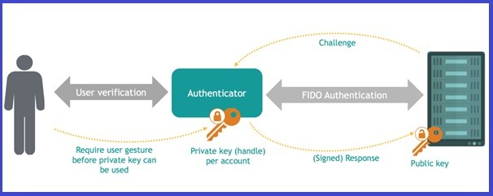
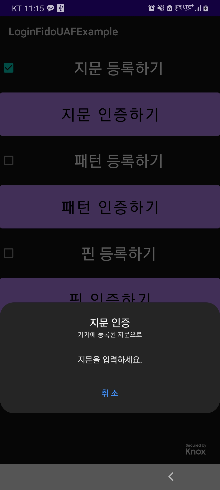

# FIDO UAF를 이용한 안드로이드 로그인 앱  

## FIDO UAF란?  
* FIDO(Fast IDentity Online) : 기존에 사용하던 ID, Password 방식이 아닌 지문, 홍채, 얼굴 인식 등을 이용한 새로운 인증 방식으로 두 가지 프로토콜인 'UAF', 'U2F'로 구분  
* UAF(Universal Authentication Framework) : 패스워드를 입력하지 않고 개인의 고유한 생체정보를 이용한 인증으로 Authenticator가 기기에 포함된 형태  
<p align="center"></p>  

## 구 현  
* 등록 (Registration)  
  * 지문, PIN, Pattern 등록 후 Key Pair 생성 (Public Key는 서버로 송신)
* 인증 (Authentication)  
  * 서버로부터 수신받은 Challenge를 생성한 Private Key(사용자 로컬 인증을 통한 획득)를 이용해 Response를 송신하고 서버는 이를 검증 후 인증여부 결정  
  * RSA 암호화 방식 사용  
* 사용 라이브러리  
  ```
  'androidx.biometric:biometric:1.0.1'  
  'com.andrognito.patternlockview:patternlockview:1.0.0'
  'com.andrognito.pinlockview:pinlockview:2.1.0'
  ```  

```간단하게 구현, 서버는 따로 구축은 안 하고 안드로이드 앱에 내장 (ServerSide Package 확인) ```  

## 실행화면  
<p align="center"></p>  
